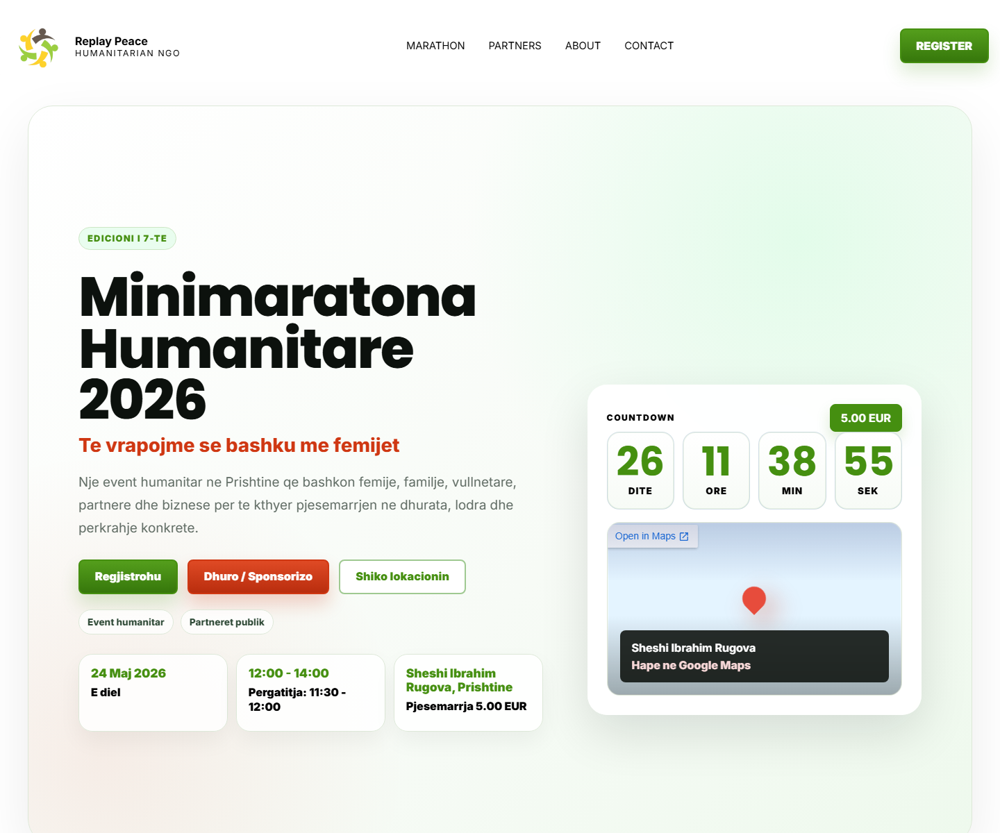

# Replay Peace Website

Portfolio case study for a humanitarian event website built for Replay Peace and the "Minimaratona Humanitare 2026" campaign.

## Live Website

https://burim-projekt.vercel.app

## Screenshot



## Overview

Replay Peace Website is a public charity/event platform for presenting the humanitarian mission, event details, partner logos, gallery moments, and race-number registration flow. The project includes a private admin area where the organizer can review registrations, approve participants, mark payments, export reports, and search through the private number list.

This repository is a public showcase only. It does not include private source code, credentials, environment variables, participant data, or Supabase keys.

## Main Features

- Public landing page for the humanitarian mini-marathon
- Event countdown and location map
- Participant registration form with anti-spam checks
- Private admin login
- Admin registration table with status filters
- Search by bib number, name, phone, email, notes, status, or source
- Manual participant registration from admin
- Approval flow with participant confirmation email
- Admin email notification for every new registration
- CSV and JSON exports for the private registration list
- Printable admin report page
- Partner/sponsor presentation page
- Gallery and mission/about pages
- Responsive design for desktop and mobile

## Technology Stack

- Next.js App Router
- React
- TypeScript
- CSS Modules/global CSS styling
- Supabase PostgreSQL for registration storage
- Resend API for transactional emails
- Vercel hosting and analytics
- Server Actions and Route Handlers for backend logic

## Architecture

The website is built as a full-stack Next.js application.

- Public pages are rendered with Next.js App Router.
- The registration form submits to a server API route.
- Server-side validation checks bib number, name, phone, email, age, notes, consent, anti-spam honeypot, and rate limits.
- Registrations are stored in Supabase PostgreSQL.
- Admin routes are protected by a signed HTTP-only session cookie.
- Admin password verification supports bcrypt password hashes.
- Admin login has basic rate limiting against repeated failed attempts.
- Email notifications are sent through Resend.
- The private admin list can be exported as CSV or JSON.

## Security Notes

- No credentials are stored in this public showcase.
- Supabase service role key is server-only and must never be exposed as `NEXT_PUBLIC_*`.
- Admin password should be stored as `ADMIN_PASSWORD_HASH`, generated with bcrypt.
- Environment variables are configured in Vercel, not committed to GitHub.
- Private registration data is not included in this repository.

## Environment Variables Used In Production

The real production project uses environment variables similar to:

```env
SUPABASE_URL=
SUPABASE_SERVICE_ROLE_KEY=
ADMIN_PASSWORD_HASH=
ADMIN_SESSION_SECRET=
RESEND_API_KEY=
RESEND_FROM_EMAIL=
ADMIN_NOTIFY_EMAIL=
PRIVATE_CONTACT_EMAIL=
REPLAY_PEACE_REPLY_TO=
NEXT_PUBLIC_FACEBOOK_PAGE_URL=
```

Values are intentionally omitted.

## Supabase Data Model

The main table is `registrations`.

It stores:

- bib number
- full name
- phone
- email
- age
- notes
- status
- source
- created/updated timestamps
- rejection reason
- approval email sent timestamp

Active registrations enforce uniqueness for bib number, email, and phone.

## Deployment

The production website is deployed on Vercel.

Typical deployment flow:

```bash
npm run build
npx vercel --prod
```

Environment variables are managed inside the Vercel dashboard.

## Project Outcome

The project gives the organizer a practical event-management workflow:

- participants register online;
- admin gets notified by email;
- organizer reviews and approves registrations;
- participants receive confirmation;
- private lists remain searchable and exportable;
- the public website presents the mission, sponsors, gallery, and event details.

## What Is Not Included Here

- Application source code
- Private registration data
- API keys
- Supabase service role key
- Resend API key
- Admin password or password hash
- `.env` files
